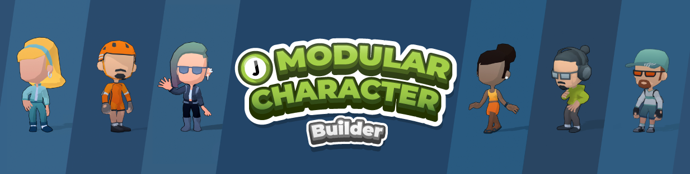
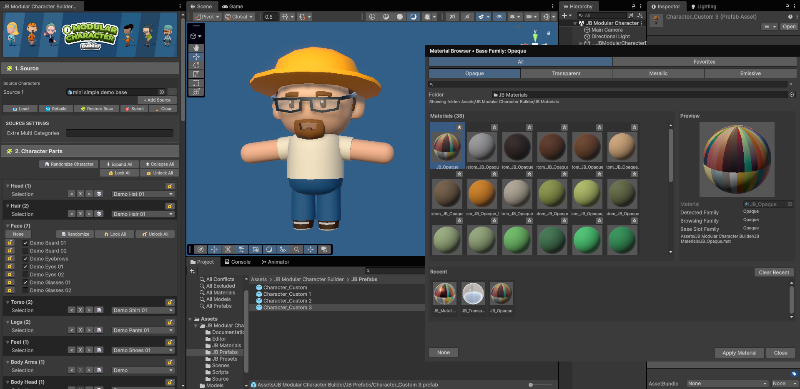

# JB Modular Character Builder 🛠️

A Unity editor tool designed to make modular character workflows faster, cleaner, and easier to manage.

## ✨ Features
- Multi-source modular character workflow
- Single-skeleton export
-  Material browser
-  Presets
-  Clean prefab export
-  Fast modular character iteration inside Unity

## ⚙️ Installation 
Import the tool into your Unity project and open it from:

**Tools > João Baltieri 3D > JB Modular Character Builder 🛠️**

For more details, see:
`Assets/JB Modular Character Builder/Documentation/`

## 📂 Included Folders 
- Editor
- Scripts
- Source
- Scenes
- Documentation
- JB Materials
- JB Prefabs
- JB Presets

## 📝 Notes
This tool is designed for compatible modular character assets that share the same rig structure.
